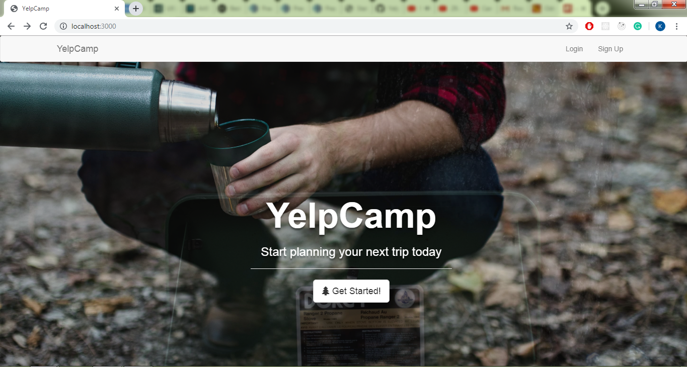
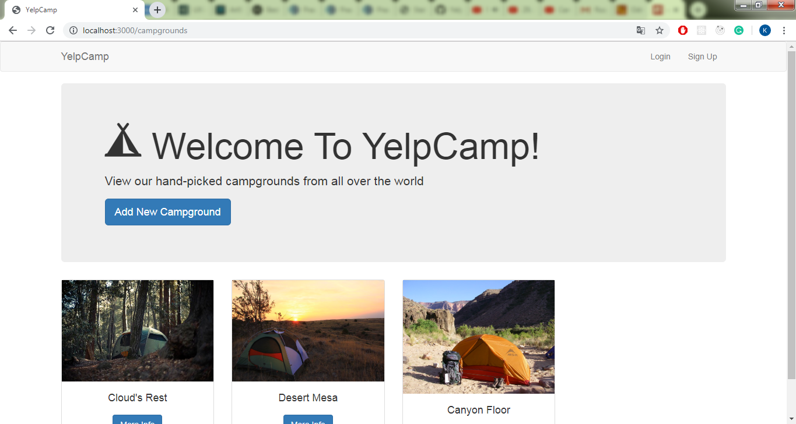
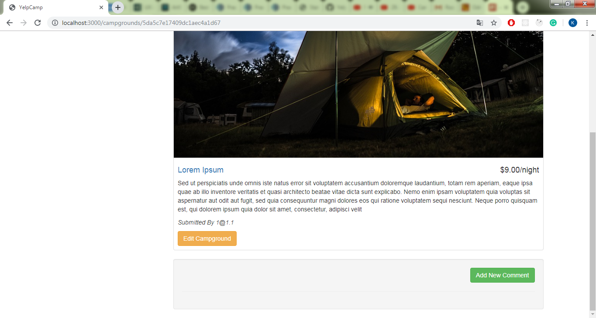

Prosta aplikacja CRUD stosujaca Restful routing dla pól kempingowych.
Projekt bazuje na kursie The Web Developer Bootcamp by Colt Steele na platformie Udemy.

link do kursu: https://www.udemy.com/the-web-developer-bootcamp/

Przy użyciu: HTML5, CSS (+Bootstrap4), jQuery, JavaScript, EJS, NodeJS, Express, MongoDB, Mongoose.
Jeden commit, jako że nie wiedziałem wtedy nic o gicie.

------------------------------------------------------

Basic CRUD web application with RESTful routing for campgrounds.
Project created based on the Udemy course - The Web Developer Bootcamp by Colt Steele.

link to the course: https://www.udemy.com/the-web-developer-bootcamp/

Technologies used: html5, css (incl Bootstrap4), Javascript, NodeJS, Express, MongoDB, Mongoose, jQuery, AJAX.
One commit as i didnt know what git was at the time.

--------------------------------------------------

Screenshots

